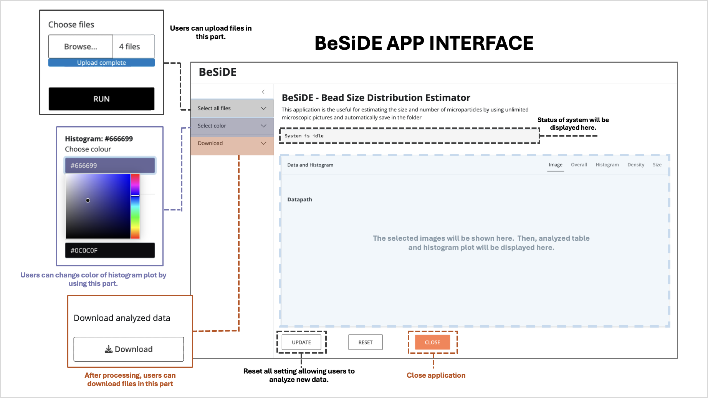
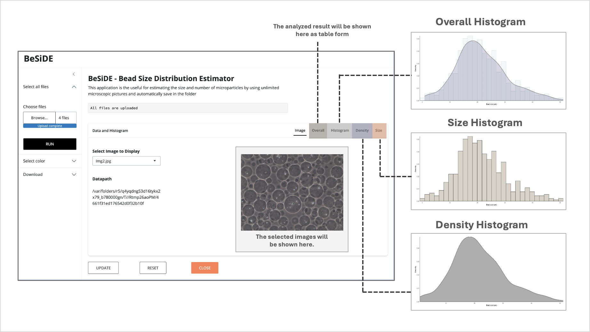

# Summary
`BeSiDE` (Bead Size Distribution Estimator) is a Shiny application developed using R packages for estimating the size of spherical microparticles from multiple microscopic images. The application detects bead particles from microscopic images uploaded by users and analyzes them to generate a histogram of particles size distribution. The results can be downloaded by the user. `BeSiDE` provides a valuable tool for wet lab scientist working with microscopic images of bead particles, allowing rapid size distribution analysis and histogram generation within seconds.

# Statement of need
Hydrogel beads and microparticles are commonly utilized to encapsulate drugs, biological molecules, and even bacterial or mammalian cells for delivery or containment purposes [@gel_cite]. The properties of these bead particles are described by various factors, including their composition, charge, morphology, and size [@micro_cite]. Once bead particles are prepared, their properties are meticulously assessed to ensure that they meet desired specifications. Among the properties of bead particles, a spherical shape and size monodispersity are typically the desired outcomes. Morphology of beads in the samples are first examined using a microscope, and then their size is directly estimated using specific equipments or indirectly detected from microscopic images using image analysis software such as ImageJ  [@ImageJ_cite]. These applications often analyze one image at a time and do not autonomously generate histograms representing the size distribution of the microparticles, making it difficult and cumbersomeness for wet lab users to work with multiple images and software. Since there is no application that can handle multiple microscopic images simultaneously to measure the size of spherical microparticles and report the size distribution as a histogram, we have developed a simple web application that can easily perform the above tasks. The application was deployed in the ShinyApp server and distributed from the source package to run on a standalone local server.

# Overview
The entire application interface is divided into three main sections: the Sidebar menu, the Status display, and the Main panel (Figure 1). The Sidebar consists of three components: the file upload, the histogram color selection, and the download sections. The main panel displays the user-selected images and presents the analyzed results in the form of tables and histogram plots. In the application, users can upload multiple microscopic images with a consistent magnification of 200 (e.g. 20X objective and 10X ocular) through the designated file upload button. Once the images are uploaded, they are processed by the "microsizer" function provided by the ‘pliman’ [@pliman_cite] and ‘EBImage’ [@EBImage_cite] R packages. This function examines each image to identify and measure morphology and size of microparticles. The processed results are filtered to contain only data for spherical microparticles and saved in a comma separated values (csv) format for compatibility and further analysis. The application also provides a detailed visual representation of the analyzed data by three graphical histograms: size, density, and overall histograms (Figure 2) and table data using  ‘DT’ R package [DT_cite]. The application includes features that allow users to customize the visual appearance of the histograms using the R package ‘colourpicker’ [@color_cite]. Users can modify the colors of each histogram plot separately, enhancing the visual appeal and clarity of the data presentation for publication-read images. These results can be saved and downloaded for facilitating the convenient management of all relevant data. 

# Usage
The tutorial and source code for this application are available on the GitHub repository (https://github.com/Machanix/BeSIDE). The working WebApp is deployed in the public ShinyApp server (https://beside-machanixx.shinyapps.io/Documents/). As the application is implemented using the R programming language, user can download the R code and run it on their local computers.

# Figures

 Figure 1. The BeSiDE application interface. The interface can be divided into three sections (Sidebar menu, Status display, and Main panel). 

&nbsp;

 Figure 2. The BeSiDE application after analyze microscopic images. The results will be as histograms including size histogram, density histogram, and an overall histogram. 

# Acknowledgement
I would like to extend my gratitude to Professor In-Geol Choi and the members of the Computational & Synthetic Biology Lab in the Department of Biotechnology at Korea University for their invaluable assistance in the development and enhancement of this application.

# References
