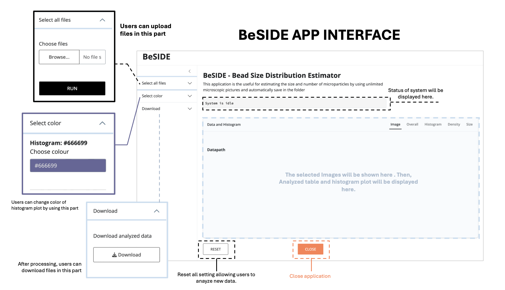
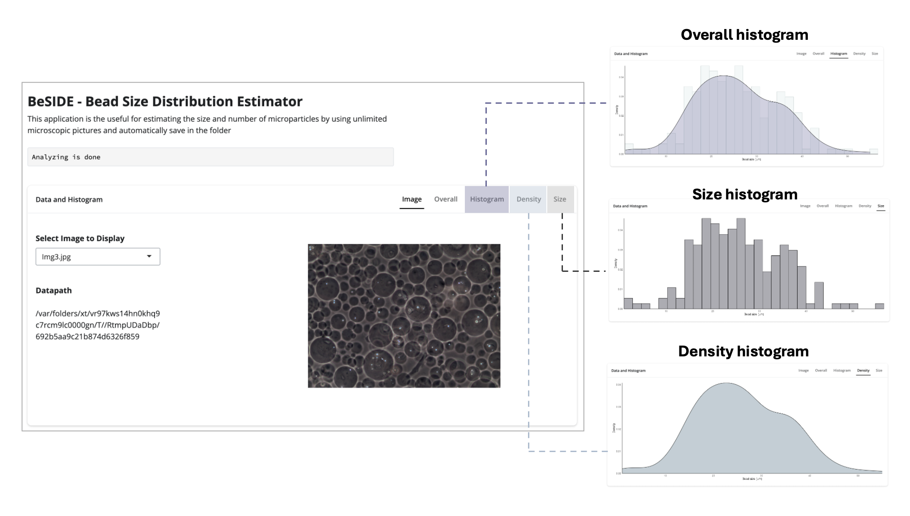

# Summary
`BeSIDE` , also known as the Bead Size Distribution Estimator, is a Shiny application developed using R packages for estimating the size of spherical microparticles from multiples microscopic images. The application processes and analyzes all uploaded images to generate a histogram of the size distribution, which users can download. `BeSIDE`offers a valuable tool for professionals working with microparticles, enabling rapid analysis and histogram generation within seconds.

# Statement of need
In the field of encapsulation and biocontainment, microparticles are commonly utilized to encapsulate drugs, biological molecules, and even bacterial or mammalian cells for delivery or analysis purposes. The properties of these microparticles depend on various factors, including their composition, charge, morphology, and size (Suri et al., 2013). Consequently, after the production of microparticles, their properties are meticulously assessed to ensure they meet desired specifications. Regarding morphology and size, a spherical shape and monodispersity are typically the desired outcomes. Post-production, samples are examined using a microscope to check their morphology, and their size is estimated using specific equipments or image analysis software such as ImageJ (Schneider et al., 2012). However, these applications can only analyze one image at a time, and they do not autonomously generate histograms representing the size distribution of the microparticles, leading to significant time consumption for users. To our knowledge, there is currently no application available that can analyze multiple microscopic images simultaneously, determine the size of spherical microparticles, and display the results as a histogram. Therefore, we have developed an application that can perform these tasks efficiently, analyzing multiple microscopic images at once, determining the size of microparticles, and presenting the data in a histogram plot.

# Overview
The overall application interface is organized into three main sections: the sidebar, the status display, and the main panel (Figure 1). The sidebar comprises three components: the file upload section, the histogram color selection section, and the download section. The main panel displays the user-selected images and presents the analyzed results in the form of table and histogram plots. In the application, users have the capability to upload multiple microscopic images with a consistent magnification of 200 (20X) through the designated file upload button. Once the images are uploaded, they are processed by the "microsizer" function, which leverages the R packages (Olivoto, 2022) pliman and EBImage (Pau et al., 2010) for comprehensive analysis. This function examines each image to identify and measure microparticles. The filtered results, containing only the data for spherical microparticles, are then saved in a .csv file format for easy access and further analysis. Then, the application provides a detailed representation of the analyzed data in the form of histograms, which are categorized into three distinct types: size histogram, density histogram, and an overall histogram that integrates both size and density information (Figure 2). Moreover, the application includes features that allow users to customize the appearance of the histograms using the R package colourpicker (Attali, 2022), users can modify the colors of each histogram plot separately, enhancing the visual appeal and clarity of the data presentation. In addition, the application facilitates the convenient saving of all relevant data. Users can download the raw data in a .csv file format and the histogram plots can be saved as .png files, providing a readily accessible and shareable format for presenting the analyzed data.

# Usage
The tutorial and source code for this application are available on GitHub. As the application is implemented using the R programming language, users can download the R code and run it on their local computers for enhanced efficiency

# Figures

 Fig 1. The BeSIDE application interface. 

 Fig 2. The BeSIDE application after analyze microscopic images. The results will be as histograms including size histogram, density histogram, and an overall histogram. 

# Acknowledgement
I would like to extend my gratitude to Professor In-Geol Choi and the members of the Computational & Synthetic Biology Lab in the Department of Biotechnology at Korea University for their invaluable assistance in the development and enhancement of this application.

# References
